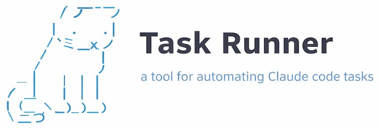

Task Runner is a CLI tool that automates iterative code improvements using Claude AI. It identifies issues via custom candidate sources, sends them to Claude for fixing, verifies the results, and commits successful improvements.

## Installation

```bash
go build -o bin/task-runner
```

Then add the bin directory to your path:

```bash
export PATH="$PATH:/your/path/to/task-runner/bin"
```

## Quick Start

1. Create a `task-runner/` directory in your project root
2. Add a `config.yaml` with global settings
3. Create task directories with `task.yaml` files
4. Run: `task-runner <task-name>`

## Configuration

### Directory Structure

```
project-root/
├── task-runner/
│   ├── config.yaml           # Global configuration
│   └── mytask/               # Task directory
│       ├── task.yaml         # Task definition
│       └── template.txt      # Optional prompt template
```

### config.yaml (Global)

```yaml
# Path to Claude CLI, you can find this by running `claude doctor`
claude_command: "~/.claude/local/node_modules/.bin/claude"
# Run on successful fix (candidate no longer returned from candidate source)
success_command: "git commit -m 'Fix: $CANDIDATE'"
# Reset changes on failure (candidate still present)
reset_command: "git reset --hard"
# Verify build after fix, such as by linting or running unit tests
verify_command: "cargo check"
```

### task.yaml (Per-Task)

```yaml
candidate_source: "cargo check 2>&1 | grep error" # Command to find candidates
prompt: "Fix this issue: $INPUT" # Prompt text (or use template)
template: "template.txt" # Load prompt from file instead
claude_flags: "--fast" # Optional Claude CLI flags
accept_best_effort: false # Accept partial fixes
```

## Usage

```bash
# List available tasks
task-runner --list

# Run a task
task-runner mytask

# Run with iteration limit
task-runner mytask --limit 10

# Preview prompts without executing
task-runner mytask --dry-run --verbose

# Distribute work across parallel runners
task-runner mytask --evens   # Process candidates with even MD5 hash
task-runner mytask --odds    # Process candidates with odd MD5 hash
```

### CLI Flags

| Flag        | Description                            |
| ----------- | -------------------------------------- |
| `--list`    | List all available tasks               |
| `--limit N` | Maximum iterations (0 = unlimited)     |
| `--dry-run` | Print prompts without executing Claude |
| `--verbose` | Print full prompt content              |
| `--evens`   | Only process candidates with even hash |
| `--odds`    | Only process candidates with odd hash  |

## How It Works

1. Runs your candidate source to identify **candidates** (issues to fix)
2. Selects the first unprocessed candidate
3. Sends candidate details to Claude with your templated prompt
4. Verifies the fix by re-running the candidate source
5. Commits successful fixes or resets on failure
6. Repeats until done or limit reached

### Task Modes

- **Standard Mode** (`accept_best_effort: false`): Resets changes if fix doesn't fully resolve the candidate
- **Best-Effort Mode** (`accept_best_effort: true`): Commits partial improvements even if candidate isn't fully fixed

## Prompt Templates

Templates support `$INPUT` variable interpolation for accessing candidate data:

| Syntax          | Description                          | Example                    |
| --------------- | ------------------------------------ | -------------------------- |
| `$INPUT`        | Whole input (single items unwrapped) | `"file.go"` or `["a","b"]` |
| `$INPUT[0]`     | Array index (0-based)                | First element              |
| `$INPUT[1]`     | Array index                          | Second element             |
| `$INPUT[1:]`    | Slice from index to end              | `["b","c","d"]`            |
| `$INPUT["key"]` | Map key lookup                       | Value for key              |

**Special cases:**

- Single-item arrays are unwrapped: `$INPUT` on `["x"]` returns `"x"`
- Out of bounds index returns empty string
- Missing map key returns empty string

**In commands** (success_command, etc.):

- `$CANDIDATE` - Full candidate key (JSON serialization)
- `$TASK_NAME` - Current task name

### Candidate Format

Candidate sources must output JSON. Each candidate can be:

**Strings** (simple case):

```json
["file1.go", "file2.go", "file3.go"]
```

**Arrays** (multiple values per candidate):

```json
[
  ["file.go", "10", "error message"],
  ["other.go", "20", "warning"]
]
```

Access with `$INPUT[0]`, `$INPUT[1]`, `$INPUT[1:]`

**Maps** (named fields):

```json
[{ "file": "test.go", "line": 10, "type": "error" }]
```

Access with `$INPUT["file"]`, `$INPUT["line"]`

### Candidate Keys

Each candidate has a unique key used for tracking in `ignored.log`:

- **Strings**: The string itself (`file.go`)
- **Arrays**: JSON serialization (`["file.go","10"]`)
- **Maps**: JSON serialization (`{"file":"test.go","line":10}`)

## Generated Files

Each task directory will contain auto-generated files:

- `ignored.log` - Processed candidates (prevents reprocessing)
- `claude.log` - Full Claude interaction logs for auditing

## Controls

- Press `Ctrl+\` (SIGQUIT) to gracefully stop after the current iteration
- Exponential backoff on consecutive failures (5min → 10min → 20min → 40min → 1hr max)
- Rate limit detection ("You've hit your limit") triggers immediate 1-hour backoff

## What is the cat's name?

Nigel.

## License

MIT
