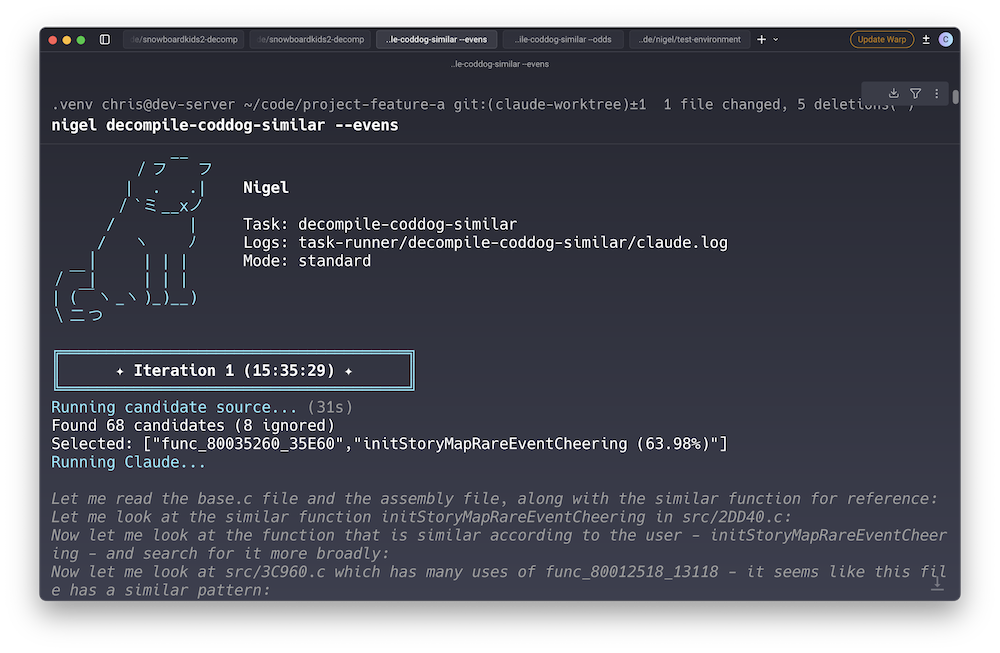

Nigel is a tool for automating iterative code improvements using Claude Code. You specify a task and a set of candidates. Nigel works through the task with appropriate success/failure handling, logging, guardrails, etc.

Nigel was developed as part of my work on the [Snowboard Kids 2 Decompilation](https://github.com/cdlewis/snowboardkids2-decomp) but I have split it off into its own project so that I can use it elsewhere. You can still find [real-world examples](https://github.com/cdlewis/snowboardkids2-decomp/tree/main/task-runner) of Nigel in that project.

## How It Works

1. Runs your **candidate source** to identify tasks to run
2. Selects the first unprocessed candidate
3. Sends candidate details to Claude with your templated prompt
4. Runs your **verify command** (e.g. `cargo check`)
5. Checks if the candidate is still present in the source
6. Commits successful tasks or resets the project on failure
7. Repeats until done or limit reached

A task is only considered successful if the candidate disappears from the source. This can be relaxed with `accept_best_effort: true` if you want to keep partial improvements.

## Why Nigel?



Nigel may be a good fix for you if you need to run a large number of long-running tasks, which in turn may need to be tuned/customised over time.

I love Nigel because:
* Tasks are expressed via configuration: it is to experiment with new ideas by copying an existing task and tweaking it;
* Candidate sources are just the JSON / newline delimited output of shell commands so it's easy to drop in existing scripts or write new ones. There's no special schema.
* Claude's output is streamed and presented to you like a normal session despite you running in non-interactive mode. This is far nicer than seeing a blank screen for an hour while Claude churns through a particularly gnarly task!
* You can tell Nigel to stop after the current task finishes with Ctrl-\\. Again, great for long running sessions where you want to try something new but don't want to throw way 30+ minutes of work.
* Built in parallelism support with --evens and --odds, letting you distribute tasks across multiple worktrees without conflicts.
* Nigel is extensively tested with both unit and integration tests.
* He's a cat

## Requirements

- Go 1.21+
- [Claude Code](https://docs.anthropic.com/en/docs/claude-code) installed and authenticated

## Installation

```bash
go build -o bin/nigel ./src
```

Then add the bin directory to your path:

```bash
export PATH="$PATH:/your/path/to/nigel/bin"
```

## Quick Start

1. Create a `nigel/` directory in your project root
2. Add a `config.yaml` with global settings
3. Create task directories with `task.yaml` files
4. Run: `nigel <task-name>`

Minimal example:

```
project-root/
├── nigel/
│   ├── config.yaml
│   └── fix-errors/
│       └── task.yaml
```

**config.yaml:**
```yaml
claude_command: "~/.claude/local/node_modules/.bin/claude"
verify_command: "cargo check"
success_command: "git commit -m 'Fix: $CANDIDATE'"
reset_command: "git reset --hard"
```

**fix-errors/task.yaml:**
```yaml
candidate_source: "cargo check 2>&1 | grep -oP 'error\\[E\\d+\\].*' | jq -R -s 'split(\"\\n\") | map(select(length > 0))'",
prompt: "Fix this compiler error: $INPUT"
```

You can override the global `claude_command` for a specific task by adding `claude_command` to your `task.yaml`:

## Usage

```bash
# List available tasks
nigel --list

# Run a task
nigel mytask

# Run with iteration limit
nigel mytask --limit 10

# Preview prompts without executing
nigel mytask --dry-run --verbose

# Distribute work across parallel runners
nigel mytask --evens   # Process candidates with even MD5 hash
nigel mytask --odds    # Process candidates with odd MD5 hash

# Override task settings temporarily
nigel mytask --task-timeout 5m      # Per-candidate timeout
nigel mytask --claude-command "~/custom/claude"
```

| Flag                | Description                                         |
| ------------------- | --------------------------------------------------- |
| `--list`            | List all available tasks                            |
| `--limit N`         | Maximum iterations (0 = unlimited)                  |
| `--time-limit`      | Maximum duration for entire task run                |
| `--task-timeout`    | Per-candidate timeout (overrides task.yaml)         |
| `--claude-command`  | Claude command to use (overrides task.yaml)         |
| `--dry-run`         | Print prompts without executing Claude              |
| `--verbose`         | Print full prompt content and show command overrides |
| `--evens`           | Only process candidates with even hash              |
| `--odds`            | Only process candidates with odd hash               |

## Configuration

### config.yaml (Global)

```yaml
# Path to Claude CLI (find this by running `claude doctor`)
claude_command: "~/.claude/local/node_modules/.bin/claude"

# Runs after Claude makes changes, before checking if candidate is resolved
verify_command: "cargo check"

# Runs when candidate is no longer present in source
# Available variables: $CANDIDATE (JSON), $TASK_NAME
success_command: "git commit -m 'Fix: $CANDIDATE'"

# Runs when candidate is still present (or verify failed)
reset_command: "git reset --hard"
```

### task.yaml (Per-Task)

```yaml
candidate_source: "cargo check 2>&1 | grep error"
prompt: "Fix this issue: $INPUT"       # Inline prompt, or...
template: "template.txt"               # ...load from file
claude_flags: "--fast"                 # Optional CLI flags
claude_command: "~/.claude/custom"     # Override global claude_command
accept_best_effort: false              # Accept partial fixes
timeout: "5m"                          # Per-candidate timeout (optional)
```

**Timeouts**

The `timeout` option limits how long Claude can spend on a single candidate. When timeout is reached, Claude is interrupted and Nigel handles the current work:

- If `accept_best_effort: true` and build passes, commits partial progress
- Otherwise, resets changes and marks candidate as ignored

Duration format: `30s`, `5m`, `1h`, etc. (Go `time.ParseDuration` format).

This is different from the `--time-limit` CLI flag which applies to the entire task run. Timeout applies per-candidate.

## Candidate Sources

A candidate source is a command that outputs JSON - a list of things for Nigel to work through. Candidates are evaluated in order and re-generated between runs. Once a candidate has been processed, it won't be retried (tracked via `ignore.log` in your task directory - remove entries to retry them).

Three output formats are supported:

**Strings** - for simple single-value candidates:

```json
["file1.go", "file2.go", "file3.go"]
```

Access in prompt with `$INPUT`.

**Arrays** - when you need multiple values per candidate (e.g. file, line number, message):

```json
[
  ["file.go", "10", "error message"],
  ["other.go", "20", "warning"]
]
```

Access in prompt with `$INPUT[0]`, `$INPUT[1]`, `$INPUT[1:]`.

**Maps** - for self-documenting structured data:

```json
[{ "file": "test.go", "line": 10, "type": "error" }]
```

Access with `$INPUT["file"]`, `$INPUT["line"]`.

## Prompts

Prompts tell Claude what to do with each candidate. You can either inline them in `task.yaml`:

```yaml
prompt: "Fix this compiler error: $INPUT"
```

Or use a template file for longer prompts:

```yaml
template: "template.txt"
```

**template.txt:**
```
Fix the following compiler error in this codebase.

Error: $INPUT[0]
File: $INPUT[1]
Line: $INPUT[2]

Make the minimal change necessary to resolve the error.
```

### Variable Reference

| Syntax          | Description                          | Example Output             |
| --------------- | ------------------------------------ | -------------------------- |
| `$INPUT`        | Whole input (single items unwrapped) | `"file.go"` or `["a","b"]` |
| `$INPUT[0]`     | Array index (0-based)                | First element              |
| `$INPUT[1]`     | Array index                          | Second element             |
| `$INPUT[1:]`    | Slice from index to end              | `["b","c","d"]`            |
| `$INPUT["key"]` | Map key lookup                       | Value for key              |

## Best-Effort Mode

By default, Nigel resets changes if the candidate is still present after Claude's fix. This makes sense for things like compiler errors where you need exact resolution.

For tasks where partial progress is valuable (refactoring, lint fixes, etc.), set:

```yaml
accept_best_effort: true
```

This commits whatever Claude produces, regardless of whether the candidate fully resolves.
